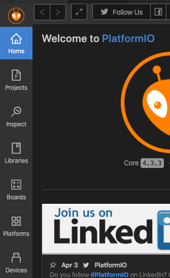
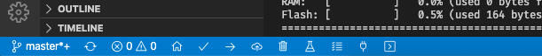

<!-- # Avr - Relógio com cronômetro e alarme

 -->

<h1 align="center">Avr - Relógio com cronômetro e alarme</h1>

</img>

*Mais detalhes das compilações: [CI Github Actions](https://github.com/guilhermerodrigues680/avr-clock-with-stopwatch-and-alarm/actions?query=branch%3Amaster)*

**Part 2 - Guia 5 - Timer/Counter 1, Estrutura e Ponteiro**

Trabalho do Laboratório de Sistemas Embutidos Microprocessados

Acesse a simulação em: [guilhermerodrigues680.github.io/avr-clock-with-stopwatch-and-alarm/](https://guilhermerodrigues680.github.io/avr-clock-with-stopwatch-and-alarm/)

## Começando

Estas instruções são necessárias para copiar, executar e editar o projeto em sua maquina.

### Pré-requisitos

1. [Visual Studio Code](https://code.visualstudio.com/)
2. [PlatformIO IDE for VSCode](https://platformio.org/install/ide?install=vscode)
3. [Atmel AVR · Platforms · PlatformIO](https://platformio.org/platforms/atmelavr)

OBS: Para instalar o item numero 3 basta abrir o PlatformIO no Visual Studio Code e ir na barra esquerda no botão **Platforms**.

### Compilando

Ultilize os icones da barra inferior do Visual Studio Code

## Sobre o Projeto

Foi ultilizada a idéia de máquinas de estado, assim os botões tem ações específicas em cada tela.

- **Botão conectado ao PORTD2:**
    - Tela Relogio: Entra na tela de configurar alarme.
    - Tela Ajuste Alarme: Seleciona hora ou minuto para ajustar e volta para tela do Relogio.
    - Tela Ajuste Relogio: Seleciona hora, minuto ou segundo para ajustar.
    - Tela Cronometro: Zera o cronometro e volta para tela do Relogio se pressionado com o cronometro zerado.
- **Botão conectado ao PORTD3:**
    - Tela Relogio: Entra na tela do cronometro.
    - Tela Ajuste Alarme: Entra na tela de ajustar relogio.
    - Tela Ajuste Relogio: Entra na tela de configurar relogio.
    - Tela Cronometro: Inicia/Pausa o cronometro
- **Potênciometro:**
    - Define valores nos ajustes do relógio e do alarme.

## Bugs Conhecidos

- Nenhum até o momento

## Autores

* **Arthur Siqueira** - *Graduando, Eng. Controle e Automação - PUC Minas*
* **Guilherme Rodrigues** - *Graduando, Eng. Controle e Automação - PUC Minas* - [GuilhermeRodrigues680](https://github.com/guilhermerodrigues680)

## Reconhecimentos

* http://ww1.microchip.com/downloads/en/DeviceDoc/ATmega48A-PA-88A-PA-168A-PA-328-P-DS-DS40002061A.pdf
* https://sites.google.com/site/qeewiki/books/avr-guide/external-interrupts-on-the-atmega328
* https://st2.ning.com/topology/rest/1.0/file/get/1802471361?profile=RESIZE_1024x1024